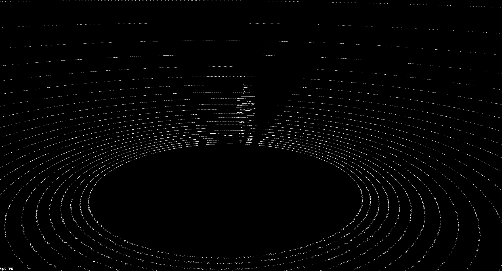
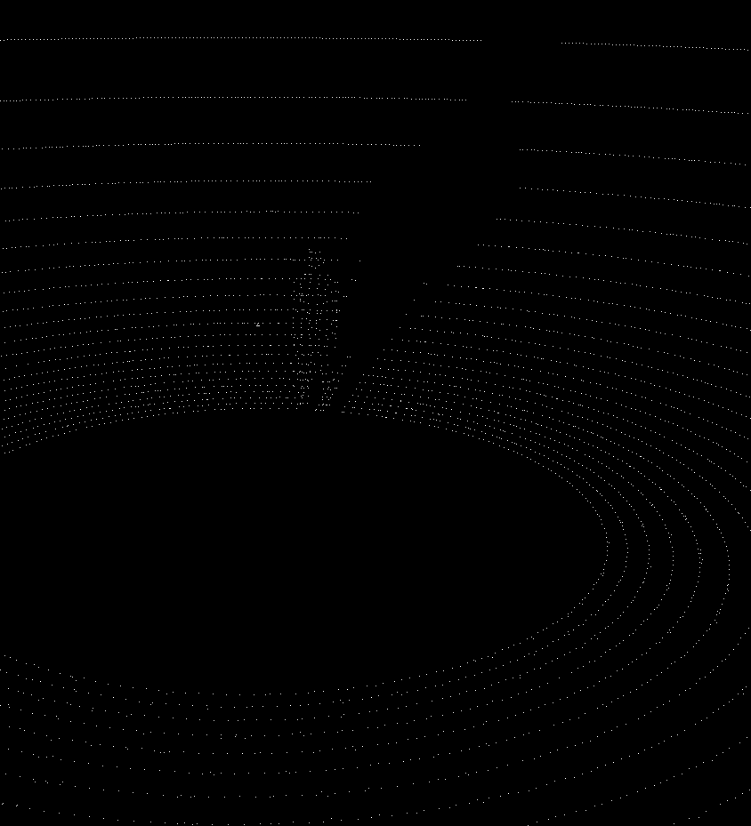
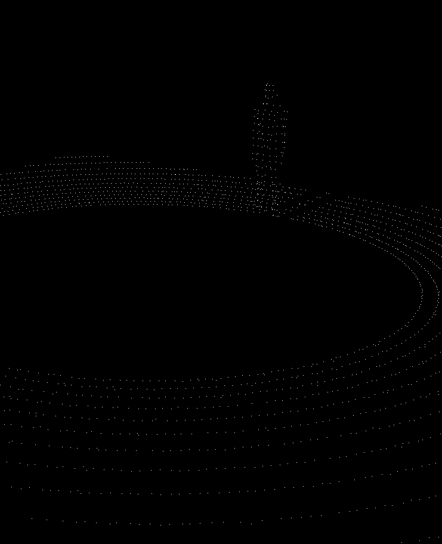
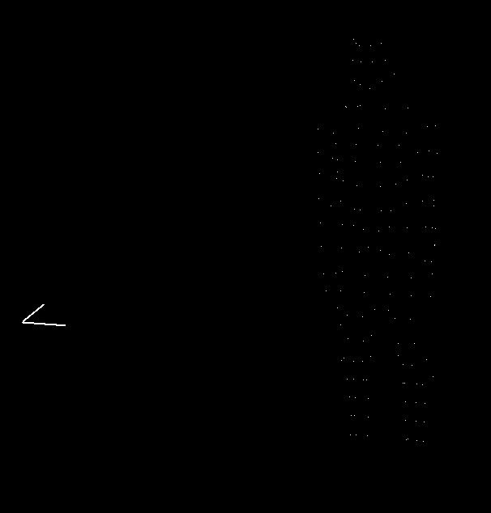

# HDM

3D Lidar Human Detection Module

## Backlog
https://docs.google.com/spreadsheets/d/1--ecBQO27Q_yDZIuTU98IUCulypahKdAMgMWPD-0olM/edit?usp=sharing

## Overview

This project demonstrates the ability to detect and localize Human obstacles in 3 dimensional space utilizing a head mounted 3d Lidar.
It takes in a Point Cloud data and outputs the X, Y and Z coordinate of the detected Human in the field. 

The primary workflow consists of parsing a .PCD file and converting it into a pcl::PointXYZ format.
A Voxel Grid Filter is then applied to downsample the high-res data into uniformly spaced points.
A passthrough filter ensures that a reasonbable range of datapoints is selected. (x:-5:5, y:-5:5, z:-2:0.5)

Using SACSegmentation we deduce the ground plane by randomly trying to fit points on the plane, we find the ground plane when considerable points satisfy the equation of a plane. These points are then subtracted from the original point cloud which leaves us with the point clouds of the objects around the Lidar.
A built in Euclidean clustering algorithm is employed to give the most dominant cluster in terms of number of points whose centroid quite closely approximates the relative coordinates of the detected human.

The core library used in completeing this project is the Point Cloud Library. 
The filtering, segmentation, visualization and data manupilation modules provided have greatly increased work efficiency throughout the project.

## Dependencies

These instructions will get you a copy of the project up and running on your local machine for development and testing purposes.

### Prerequisites

Either you can install the prebuilt PCL library for Linux using the following command

```
sudo add-apt-repository ppa:v-launchpad-jochen-sprickerhof-de/pcl
sudo apt-get update
sudo apt-get install libpcl-all
```
from [PointCloud](http://www.pointclouds.org/downloads/linux.html) - Prebuilt binaries for Linux

##### OR

You can compile from source following the instructions below:

Install oracle-java8-jdk:
```
sudo add-apt-repository -y ppa:webupd8team/java 
sudo apt update 
sudo apt -y install oracle-java8-installer
```

Install universal pre-requisites:
```
sudo apt -y install g++ cmake cmake-gui doxygen mpi-default-dev openmpi-bin openmpi-common libusb-1.0-0-dev libqhull* libusb-dev libgtest-dev
sudo apt -y install git-core freeglut3-dev pkg-config build-essential libxmu-dev libxi-dev libphonon-dev libphonon-dev phonon-backend-gstreamer
sudo apt -y install phonon-backend-vlc graphviz mono-complete qt-sdk libflann-dev
```

##### For PCL v1.8 on Ubuntu 16.04.2 run the following:

##### Dependencies:

```
sudo apt -y install libflann1.8 libboost1.58-all-dev

cd ~/Downloads
wget http://launchpadlibrarian.net/209530212/libeigen3-dev_3.2.5-4_all.deb
sudo dpkg -i libeigen3-dev_3.2.5-4_all.deb
sudo apt-mark hold libeigen3-dev

wget http://www.vtk.org/files/release/7.1/VTK-7.1.0.tar.gz
tar -xf VTK-7.1.0.tar.gz
cd VTK-7.1.0 && mkdir build && cd build
cmake ..
make
sudo make install
```

##### Now download and compile PCL1.8 source code
```
cd ~/Downloads
wget https://github.com/PointCloudLibrary/pcl/archive/pcl-1.8.0.tar.gz
tar -xf pcl-1.8.0.tar.gz
cd pcl-pcl-1.8.0 && mkdir build && cd build
cmake ..
make
sudo make install

cd ~/Downloads
rm libeigen3-dev_3.2.5-4_all.deb VTK-7.1.0.tar.gz pcl-1.8.0.tar.gz
sudo rm -r VTK-7.1.0 pcl-pcl-1.8.0
```


### Installation Human Obstacle Detector

##### Standard install via command-line
```
git clone https://github.com/mjerrar/HDM
cd <path to repository>
mkdir build
cd build
cmake ..
make
Run tests: ./test/cpp-test
Run program: ./app/shell-app
```

## Run the demo
To run the demo simply make you that you have the testdata folder in your repo root folder.
The test data is named as 
```
vel_2m2r1545321.pcd
```
where:
    vel=Velodyne HDL32, 
    2m = 2 metres front distance,
    2l/r = 2 metres left or right
    12033465=ROS Time (can be ignored),
    .pcd = point cloud data format

The sotware is programed to look for the following PCD file
```
(repo_root)/testData/vel_3m970398000.pcd
```
you can change it accordingly.

#### Following are visualizations of the intermediate processes

Raw: 


Voxel Filtered: 


Passthrough Filtered: 


Clustered: 


###### Terminal Output
```
Loaded 
50318
1
PointCloud representing the planar component: 3270 data points.
Coordinates of Human are
x : 0.0101565
y : 2.86391
z : -0.862732
```

## License - GNU General Public License 3.0
GNU LESSER GENERAL PUBLIC LICENSE
Version 3, 29 June 2007
Copyright © 2007 Free Software Foundation, Inc. <https://fsf.org/>
Everyone is permitted to copy and distribute verbatim copies of this license document, but changing it is not allowed.
This version of the GNU Lesser General Public License incorporates the terms and conditions of version 3 of the GNU General Public License, supplemented by the additional permissions listed below.

